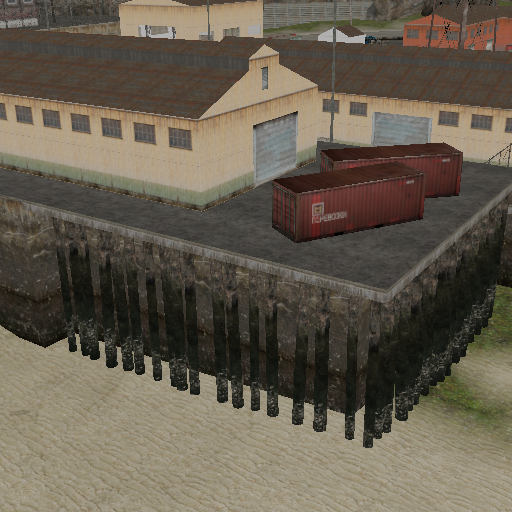
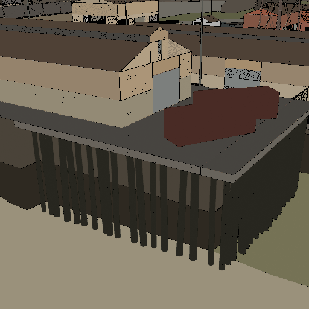
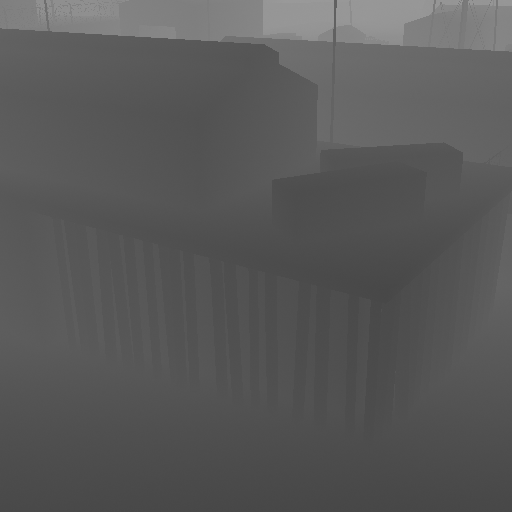
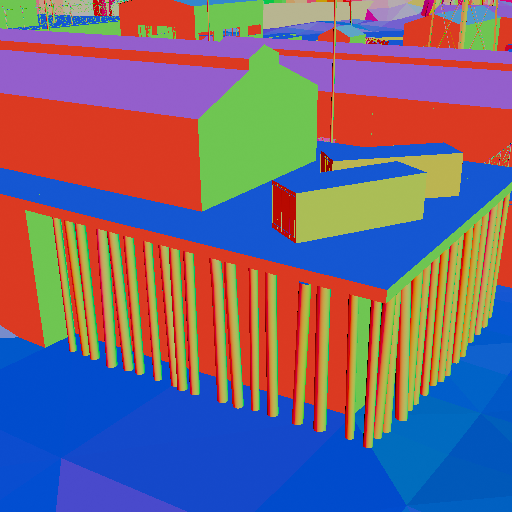
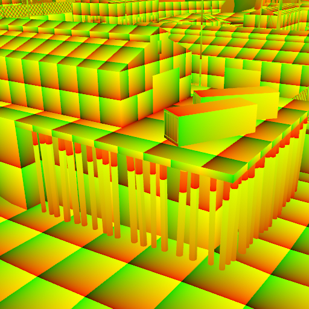
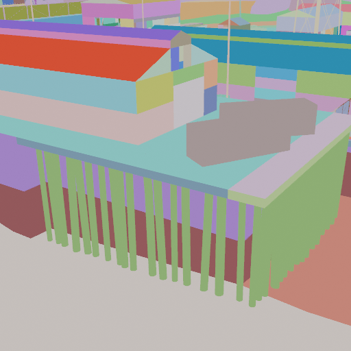

# Dataset generation

## What we need?
To train our model, we need a large collection of samples of an existing game, with color, depth, normal, UV data as well as a low-fidelity color map and a material segmentation map for every sample. Since our project's goal is to synthesize game textures, we wanted to use an existing game to obtain these samples. We settled on Half-Life 2, as its technical aspect are very well understood and the developer provides a Development SDK making it easy to modify the game.

## First attempt: Capturing screenshots from the game at runtime
Our initial idea was to automate the game taking screenshots at various places in the game. The developer console available in Half-Life 2 helped with this, as we could take advantage of the following commands:
* `noclip` - Disable gravity and collisions
* `host_timescale 0` freeze time in the world
* `hud_draw 0` - Disable the in-game HUD
* `setpos <x> <y> <z>` - Change the camera position
* `setang <euler>` - Change the camera orientation
* `screenshot` - Capture the current scene from the current camera angle
* `map <mapname>` - Load a specific map
* `mat_showlowresimage 1` - Use low-fidelity textures
* `mat_fullbright 1` - Disable shading, reflections, normal maps, etc
* `exec <filename>` - Run all commands from a file, allowing us to automate the data generation

To get normal and depth maps, we could use the [ReShade](https://reshade.me) utility, but getting UV and material segmentation maps was a bit more tricky. We got some success by using [VPKEdit](https://github.com/craftablescience/VPKEdit)'s CLI to automatically replace all the textures in the game with a UV visualization image, and using a similar approach for material segmentation match. However, this prooved a little to finicky and getting the UV maps to look right was not easy, so we needed a different method.

## Second attempt: Importing maps into Blender

The map, texture and model formats used by the Source Engine (powering Half-Life 2) are very well documented, so we wondered if it was possible to directly import maps from the game into Blender, which would make it much easier to collect the required maps. Looking online, we found that [someone had already done the work for us](https://github.com/hisprofile/blenderstuff/blob/main/Creations/Source%20Engine%20Blender%20Collection.md#half-life-2).

In Blender, we created a camera and animated its path to record the map from various angles. We could then very easily export the animation as an image sequence with color, normal, and depth maps. Getting UV maps was as easy as applying a specific "UV" material that just outputs raw texture coordinates to screen to every material using a Python script, and disabling any kind of color correction/view transform. For material segmentation, we just used a Python script to replace every material with a random unlit color.

We didn't find a straight-forward way to generate low-fidelity maps that didn't involve downscaling the entire image and losing edge accuracy, so we used another script that used the color and material image sequences to procedurally generate low-fidelity maps.

Here is an example:

**Color:**  

**Low-fidelity:**  

**Depth:**  

**Normal:**  

**UV:**  

**Materials:**  

